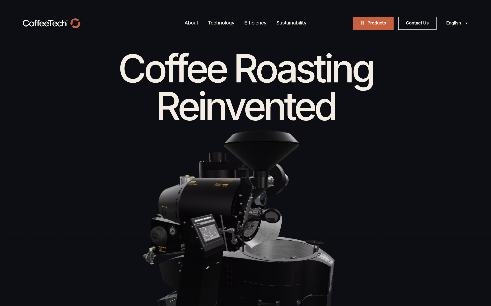

# coffee-tech DESIGN.md

> Auto-generated design system — reverse-engineered via static analysis by skillui.
> Frameworks: None detected
> Colors: 20 · Fonts: 2 · Components: 8
> Icon library: not detected · State: not detected
> Primary theme: light · Dark mode toggle: no · Motion: subtle

## Visual Reference

**Match this design exactly** — study colors, fonts, spacing, and component shapes before writing any UI code.



---

## 1. Visual Theme & Atmosphere

This is a **light-themed** interface with a cool, approachable feel. The light background emphasizes content clarity. Typography pairs **Google Sans** for display/headings with **Inter** for body text, creating clear visual hierarchy through type contrast. Spacing follows a **4px base grid** (compact density), with scale: 2, 4, 6, 8, 10, 12, 14, 16px. The accent color **#0082f3** anchors interactive elements (buttons, links, focus rings). Motion is subtle — smooth transitions (150-300ms) ease state changes without drawing attention.

---

## 2. Color Palette & Roles

| Token | Hex | Role | Use |
|---|---|---|---|
| background | `#ffffff` | background | Page background, darkest surface |
| text-primary | `#0d0e13` | text-primary | Headings and body text |
| text-muted | `#6f6f73` | text-muted | Captions, placeholders, secondary info |
| border | `#67625e` | border | Dividers, card borders, outlines |
| accent | `#0082f3` | accent | CTAs, links, focus rings, active states |
| danger | `#c8603d` | danger | Error states, destructive actions |
| warning | `#f3ede3` | warning | Warning states, caution indicators |
| info | `#3898ec` | info | Informational highlights |
| unknown | `#dddddd` | unknown | Palette color |
| unknown | `#2f2f2f` | unknown | Palette color |
| unknown | `#222222` | unknown | Palette color |
| unknown | `#758696` | unknown | Palette color |
| unknown | `#615048` | unknown | Palette color |
| unknown | `#c8c8c8` | unknown | Palette color |
| unknown | `#000000` | unknown | Palette color |
| unknown | `#999999` | unknown | Palette color |
| unknown | `#5d6c7b` | unknown | Palette color |
| unknown | `#17171a` | unknown | Palette color |
| unknown | `#ffdede` | unknown | Palette color |
| unknown | `#a85032` | unknown | Palette color |

### CSS Variable Tokens

```css
--primary-font: "Inter",sans-serif;
--border-radius: 0.868vw;
--tags-border-radius: 100vw;
--tag-border-width: 1px;
--primary-font: "Google Sans",sans-serif;
--border-radius: 2vw;
--tags-border-radius: 100vw;
--tag-border-width: 1px;
--primary-font: "Inter",sans-serif;
--border-radius: 0.868vw;
--tags-border-radius: 100vw;
--tag-border-width: 1px;
--primary-font: "Google Sans",sans-serif;
--border-radius: 2vw;
--tags-border-radius: 100vw;
--tag-border-width: 1px;
--primary-font: "Inter",sans-serif;
--border-radius: 0.868vw;
--tags-border-radius: 100vw;
--tag-border-width: 1px;
```


---

## 3. Typography Rules

**Font Stack:**
- **Inter** — Heading 1, Heading 2, Heading 3
- **Google Sans** — Body, Caption

**Font Sources:**

```css
@font-face {
  font-family: "Google Sans";
  src: url("fonts/GoogleSans-Bold.ttf") format("truetype");
  font-weight: 700;
}
@font-face {
  font-family: "Google Sans";
  src: url("fonts/GoogleSans-Regular.ttf") format("truetype");
  font-weight: 400;
}
@font-face {
  font-family: "Inter";
  src: url("fonts/Inter-Bold.ttf") format("truetype");
  font-weight: 700;
}
@font-face {
  font-family: "Inter";
  src: url("fonts/Inter-Regular.ttf") format("truetype");
  font-weight: 400;
}
@font-face {
  font-family: "webflow-icons";
  src: url("data:application/x-font-ttf;charset=utf-8;base64,AAEAAAALAIAAAwAwT1MvMg8SBiUAAAC8AAAAYGNtYXDpP+a4AAABHAAAAFxnYXNwAAAAEAAAAXgAAAAIZ2x5ZmhS2XEAAAGAAAADHGhlYWQTFw3HAAAEnAAAADZoaGVhCXYFgQAABNQAAAAkaG10eCe4A1oAAAT4AAAAMGxvY2EDtALGAAAFKAAAABptYXhwABAAPgAABUQAAAAgbmFtZSoCsMsAAAVkAAABznBvc3QAAwAAAAAHNAAAACAAAwP4AZAABQAAApkCzAAAAI8CmQLMAAAB6wAzAQkAAAAAAAAAAAAAAAAAAAABEAAAAAAAAAAAAAAAAAAAAABAAADpAwPA/8AAQAPAAEAAAAABAAAAAAAAAAAAAAAgAAAAAAADAAAAAwAAABwAAQADAAAAHAADAAEAAAAcAAQAQAAAAAwACAACAAQAAQAg5gPpA//9//8AAAAAACDmAOkA//3//wAB/+MaBBcIAAMAAQAAAAAAAAAAAAAAAAABAAH//wAPAAEAAAAAAAAAAAACAAA3OQEAAAAAAQAAAAAAAAAAAAIAADc5AQAAAAABAAAAAAAAAAAAAgAANzkBAAAAAAEBIAAAAyADgAAFAAAJAQcJARcDIP5AQAGA/oBAAcABwED+gP6AQAABAOAAAALgA4AABQAAEwEXCQEH4AHAQP6AAYBAAcABwED+gP6AQAAAAwDAAOADQALAAA8AHwAvAAABISIGHQEUFjMhMjY9ATQmByEiBh0BFBYzITI2PQE0JgchIgYdARQWMyEyNj0BNCYDIP3ADRMTDQJADRMTDf3ADRMTDQJADRMTDf3ADRMTDQJADRMTAsATDSANExMNIA0TwBMNIA0TEw0gDRPAEw0gDRMTDSANEwAAAAABAJ0AtAOBApUABQAACQIHCQEDJP7r/upcAXEBcgKU/usBFVz+fAGEAAAAAAL//f+9BAMDwwAEAAkAABcBJwEXAwE3AQdpA5ps/GZsbAOabPxmbEMDmmz8ZmwDmvxmbAOabAAAAgAA/8AEAAPAAB0AOwAABSInLgEnJjU0Nz4BNzYzMTIXHgEXFhUUBw4BBwYjNTI3PgE3NjU0Jy4BJyYjMSIHDgEHBhUUFx4BFxYzAgBqXV6LKCgoKIteXWpqXV6LKCgoKIteXWpVSktvICEhIG9LSlVVSktvICEhIG9LSlVAKCiLXl1qal1eiygoKCiLXl1qal1eiygoZiEgb0tKVVVKS28gISEgb0tKVVVKS28gIQABAAABwAIAA8AAEgAAEzQ3PgE3NjMxFSIHDgEHBhUxIwAoKIteXWpVSktvICFmAcBqXV6LKChmISBvS0pVAAAAAgAA/8AFtgPAADIAOgAAARYXHgEXFhUUBw4BBwYHIxUhIicuAScmNTQ3PgE3NjMxOAExNDc+ATc2MzIXHgEXFhcVATMJATMVMzUEjD83NlAXFxYXTjU1PQL8kz01Nk8XFxcXTzY1PSIjd1BQWlJJSXInJw3+mdv+2/7c25MCUQYcHFg5OUA/ODlXHBwIAhcXTzY1PTw1Nk8XF1tQUHcjIhwcYUNDTgL+3QFt/pOTkwABAAAAAQAAmM7nP18PPPUACwQAAAAAANciZKUAAAAA1yJkpf/9/70FtgPDAAAACAACAAAAAAAAAAEAAAPA/8AAAAW3//3//QW2AAEAAAAAAAAAAAAAAAAAAAAMBAAAAAAAAAAAAAAAAgAAAAQAASAEAADgBAAAwAQAAJ0EAP/9BAAAAAQAAAAFtwAAAAAAAAAKABQAHgAyAEYAjACiAL4BFgE2AY4AAAABAAAADAA8AAMAAAAAAAIAAAAAAAAAAAAAAAAAAAAAAAAADgCuAAEAAAAAAAEADQAAAAEAAAAAAAIABwCWAAEAAAAAAAMADQBIAAEAAAAAAAQADQCrAAEAAAAAAAUACwAnAAEAAAAAAAYADQBvAAEAAAAAAAoAGgDSAAMAAQQJAAEAGgANAAMAAQQJAAIADgCdAAMAAQQJAAMAGgBVAAMAAQQJAAQAGgC4AAMAAQQJAAUAFgAyAAMAAQQJAAYAGgB8AAMAAQQJAAoANADsd2ViZmxvdy1pY29ucwB3AGUAYgBmAGwAbwB3AC0AaQBjAG8AbgBzVmVyc2lvbiAxLjAAVgBlAHIAcwBpAG8AbgAgADEALgAwd2ViZmxvdy1pY29ucwB3AGUAYgBmAGwAbwB3AC0AaQBjAG8AbgBzd2ViZmxvdy1pY29ucwB3AGUAYgBmAGwAbwB3AC0AaQBjAG8AbgBzUmVndWxhcgBSAGUAZwB1AGwAYQByd2ViZmxvdy1pY29ucwB3AGUAYgBmAGwAbwB3AC0AaQBjAG8AbgBzRm9udCBnZW5lcmF0ZWQgYnkgSWNvTW9vbi4ARgBvAG4AdAAgAGcAZQBuAGUAcgBhAHQAZQBkACAAYgB5ACAASQBjAG8ATQBvAG8AbgAuAAAAAwAAAAAAAAAAAAAAAAAAAAAAAAAAAAAAAAAAAAAAAA==") format("truetype");
  font-weight: 400;
}
```

| Role | Font | Size | Weight |
|---|---|---|---|
| Heading 1 | Inter | 40px | 700 |
| Heading 2 | Inter | 38px | 700 |
| Heading 3 | Inter | 32px | 700 |
| Body | Google Sans | 14px | 400 |
| Caption | Google Sans | 18px | 400 |

**Typographic Rules:**
- Limit to 2 font families max per screen
- Use **Inter** for body/UI text, **Google Sans** for display/headings
- Maintain consistent hierarchy: no more than 3-4 font sizes per screen
- Headings use bold (600-700), body uses regular (400)
- Line height: 1.5 for body text, 1.2 for headings
- Use color and opacity for secondary hierarchy, not additional font sizes


---

## 4. Component Stylings

### Layout (1)

**Footer** — `html`

### Navigation (1)

**Navigation** — `html`

### Data Display (2)

**Badge** — `html`

**List** — `html`

### Data Input (2)

**Button** — `html`
- Animation: 

**Input** — `html`
- State: :focus, :placeholder

### Overlay (1)

**Modal** — `html`

### Media (1)

**Image** — `html`


---

## 5. Layout Principles

- **Base spacing unit:** 4px
- **Spacing scale:** 2, 4, 6, 8, 10, 12, 14, 16, 18, 20, 22, 30
- **Border radius:** .05vw, .25vw, .3vw, .5rem, .5vw, .8vw, 2px, 2vw, 3px, 3.6px, 4px, 5px, 9px, 12.4992px, 50vw, 100%, 100vw, 999px, unset
- **Max content width:** 991px

**Spacing as Meaning:**
| Spacing | Use |
|---|---|
| 4-8px | Tight: related items within a group |
| 12-16px | Medium: between groups |
| 24-32px | Wide: between sections |
| 48px+ | Vast: major section breaks |


---

## 6. Depth & Elevation

### Flat — subtle depth hints

- `0 0 0 2px #fff`
- `rgba(200, 96, 61, 0.4) 0px 0px 0px 0px`

### Raised — cards, buttons, interactive elements

- `.4vw 0 0 0 var(--creme-light),0 .4vw 0 0 var(--creme-light),.4vw .4vw 0 0 var(--creme-light)`
- `.4vw 0 0 0 var(--orange),0 .4vw 0 0 var(--orange),.4vw .4vw 0 0 var(--orange)`
- `0 2px 8px rgba(0,0,0,.12)`

### Floating — dropdowns, popovers, modals

- `0 0 10px rgba(255,255,255,.5)`

### Overlay — full-screen overlays, top-level dialogs

- `0 10px 28px rgba(0,0,0,.4)`

### Z-Index Scale

`0, 1, 2, 3, 4, 10, 99, 900, 999, 1000, 2000, 9997, 9998, 9999, 10001, 9999999, 10000000, 2147482000, 2147483647, 99999999999999`


---

## 7. Animation & Motion

This project uses **subtle motion**. Transitions smooth state changes without demanding attention.

### CSS Animations

- `@keyframes text-link-fadein`
- `@keyframes modelScaleIn`
- `@keyframes heroGlowScaleIn`
- `@keyframes spin`

### Animated Components

- **Button**: 

### Motion Guidelines

- Duration: 150-300ms for micro-interactions, 300-500ms for page transitions
- Easing: `ease-out` for enters, `ease-in` for exits
- Always respect `prefers-reduced-motion`


---

## 8. Do's and Don'ts

### Do's

- Use `#0082f3` for interactive elements (buttons, links, focus rings)
- Use `#ffffff` as the primary page background
- Pair **Inter** (body) with **Google Sans** (display) — these are the only allowed fonts
- Follow the **4px** spacing grid for all margins, padding, and gaps
- Use the defined shadow tokens for elevation — see Section 6
- Use border-radius from the scale: .05vw, .25vw, .3vw, .5rem, .5vw
- Reuse existing components from Section 4 before creating new ones

### Don'ts

- Don't introduce colors outside this palette — extend the design tokens first
- Don't introduce additional font families beyond Inter and Google Sans
- Don't use arbitrary spacing values — stick to multiples of 4px
- Don't create custom box-shadow values outside the system tokens
- Don't use arbitrary border-radius values — pick from the defined scale
- Don't duplicate component patterns — check Section 4 first
- Don't use backdrop-blur or blur effects

### Anti-Patterns (detected from codebase)

- No blur or backdrop-blur effects
- No zebra striping on tables/lists


---

## 9. Responsive Behavior

| Name | Value | Source |
|---|---|---|
| xs | 479px | css |
| md | 650px | css |
| md | 767px | css |
| md | 768px | css |
| lg | 769px | css |
| lg | 991px | css |

**Approach:** Use `@media (min-width: ...)` queries matching the breakpoints above.


---

## 10. Agent Prompt Guide

Use these as starting points when building new UI:

### Build a Card

```
Background: #ffffff
Border: 1px solid #67625e
Radius: 3.6px
Padding: 16px
Font: Inter
Use shadow tokens from Section 6.
```

### Build a Button

```
Primary: bg #0082f3, text white
Ghost: bg transparent, border #67625e
Padding: 8px 16px
Radius: 3.6px
Hover: opacity 0.9 or lighter shade
Focus: ring with #0082f3
```

### Build a Page Layout

```
Background: #ffffff
Max-width: 991px, centered
Grid: 4px base
Responsive: mobile-first, breakpoints from Section 9
```

### Build a Stats Card

```
Surface: #ffffff
Label: #6f6f73 (muted, 12px, uppercase)
Value: #0d0e13 (primary, 24-32px, bold)
Status: use success/warning/danger from Section 2
```

### Build a Form

```
Input bg: #ffffff
Input border: 1px solid #67625e
Focus: border-color #0082f3
Label: #6f6f73 12px
Spacing: 16px between fields
Radius: 3.6px
```

### General Component

```
1. Read DESIGN.md Sections 2-6 for tokens
2. Colors: only from palette
3. Font: Inter, type scale from Section 3
4. Spacing: 4px grid
5. Components: match patterns from Section 4
6. Elevation: shadow tokens
```
